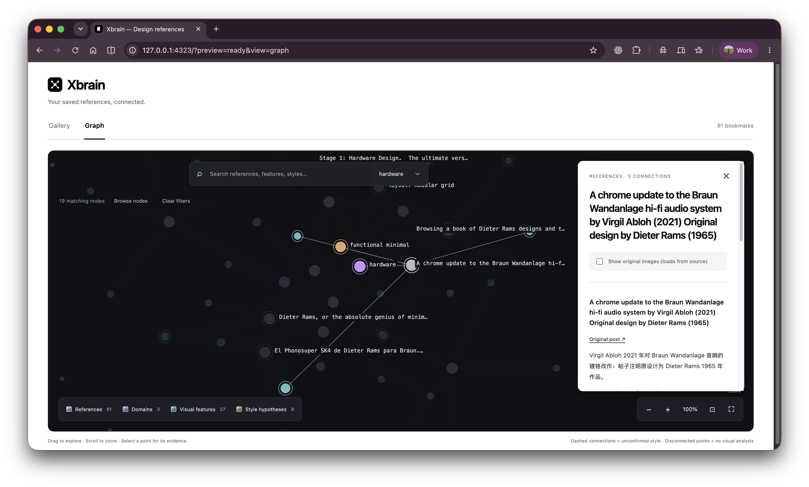

```text
Read https://github.com/MiltonHeYan/xbrain/blob/main/SKILL.md, help me install Xbrain, and organize my authorized design references for retrieval.
```

# Xbrain

**Turn scattered design references into context your Agent can find and explain.**

<p>   </p>

[English](README.md) · [简体中文](README.zh-CN.md) · [日本語](README.ja.md) · [한국어](README.ko.md)

[](https://github.com/corespeed-io/xbrain/releases/download/demo-video-v6/Xbrain-concept-v6.mp4)

[▶ Open the 34-second concept film (MP4)](https://github.com/corespeed-io/xbrain/releases/download/demo-video-v6/Xbrain-concept-v6.mp4)

## “I saved the look, but I don't know its name.”

Your Agent looks at your saved UI or interior images, records visible features and suggests possible styles with evidence. Ask for a design: retrieve relevant originals, compare shared details, confirm a direction, then turn it into requirements. Explore those connections in the local reference graph.

A saved image is not a preference. Style labels remain hypotheses until you confirm them. Images the Agent cannot view stay unanalyzed.



## What you need

Git, Node.js 22.12+, and an Agent with local commands and image understanding. Your existing connector supplies authorized bookmarks; Xbrain organizes and retrieves them. Memory works locally; you choose any external backend. [CoreSpeed](https://corespeed.io) is an optional connector choice.

[Install & use](SKILL.md) · [Design workflow & graph](docs/DESIGN.md) · [X input](docs/SYNC_BOOKMARKS.md) · [Memory](docs/MEMORY.md) · [Contribute](CONTRIBUTING.md)

MIT · By [Milton / HeYan](https://github.com/MiltonHeYan). Existing xstash data paths and commands remain compatible.
